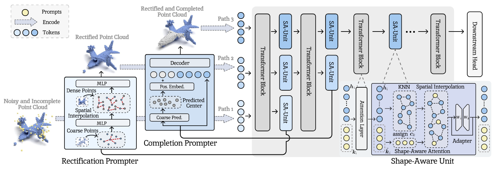
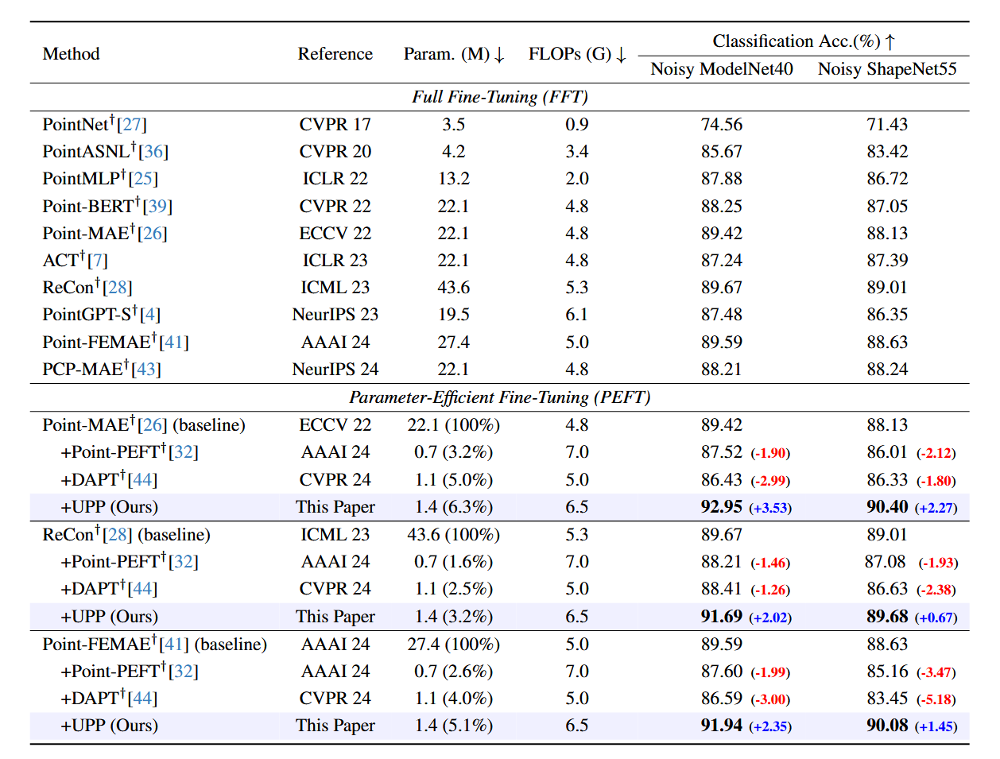

# UPP: Unified Point-Level Prompting for Robust Point Cloud Analysis
<div align="center">
    Zixiang Ai<sup>1</sup>&emsp; Zhenyu Cui<sup>1</sup>&emsp; Yuxin Peng<sup>1</sup>&emsp; Jiahuan Zhou<sup>†</sup><sup>1</sup> <br>
    <small>
    <sup>1 Wangxuan Institute of Computer Technology, Peking University&emsp; <br></sup>
    </small>
</div>

<p align="center">
  <a href='https://arxiv.org/abs/2507.18997'></a>
  <a href="https://github.com/zhoujiahuan1991/ICCV2025-UPP"></a>
</p>

<div align="center">
Official implementation of 'UPP: Unified Point-Level Prompting for Robust Point Cloud Analysis'.


The paper has been accepted by **ICCV 2025**.
</div>


<p align="center"></p>


Pre-trained point cloud analysis models have shown promising advancements in various downstream tasks, yet their effectiveness is typically suffering from low-quality point cloud (i.e., noise and incompleteness), which is a common issue in real scenarios due to casual object occlusions and unsatisfactory data collected by 3D sensors. To this end, existing methods focus on enhancing point cloud quality by developing dedicated denoising and completion models. However, due to the isolation between the point cloud enhancement and downstream tasks, these methods fail to work in various real-world domains. In addition, the conflicting objectives between denoising and completing tasks further limit the ensemble paradigm to preserve critical geometric features.

To tackle the above challenges, we propose a unified point-level prompting method that reformulates point cloud denoising and completion as a prompting mechanism, enabling robust analysis in a parameterefficient manner. We start by introducing a Rectification Prompter to adapt to noisy points through the predicted rectification vector prompts, effectively filtering noise while preserving intricate geometric features essential for accurate analysis. Sequentially, we further incorporate a Completion Prompter to generate auxiliary point prompts based on the rectified point clouds, facilitating their robustness and adaptability. Finally, a Shape-Aware Unit module is exploited to efficiently unify and capture the filtered geometric features for the downstream point cloud analysis. Extensive experiments on four datasets demonstrate the superiority and robustness of our method when handling noisy and incomplete point cloud data against existing state-of-the-art methods.

## Main Results
Classification on Noisy ModelNet40 and Noisy ShapeNet55, including the trainable parameter numbers (Param), computational cost (FLOPs), and overall accuracy. † denotes reproduced results using official code. Point cloud classification accuracy without voting is reported.

<p align="center"></p>


## Checkpoint Release
The pre-trained backbone checkpoints used in our paper are provided below.
| Backbones | Reference | Checkpoints |
| :-----: |:-----:| :-----:|
| Point-MAE | ECCV 22 | [mae_base.pth](https://github.com/Pang-Yatian/Point-MAE/releases/download/main/pretrain.pth) |
| ReCon | ICML 23 | [recon_base.pth](https://drive.google.com/file/d/1L-TlZUi7umBCDpZW-1F0Gf4X-9Wvf_Zo/view?usp=share_link) |
| Point-FEMAE | AAAI 24 | [mae_base.pth](https://drive.google.com/drive/folders/1q0A-yXC1fmKKg38fbaqIxM79lvXpj4AO?usp=drive_link) |


## Environment

Create a conda environment and install basic dependencies:
```bash
git clone git@github.com:zhoujiahuan1991/ICML2025-GAPrompt.git
cd ICML2025-GAPrompt

# Not necessary
conda create -n gaprompt python=3.9
conda activate gaprompt

# Install the corresponding versions of Torch and TorchVision; other compatible versions are also acceptable.
pip install torch==1.13.1+cu116 torchvision==0.14.1+cu116 --extra-index-url https://download.pytorch.org/whl/cu116

pip install -r requirements.txt
```
Install GPU-related packages:
```bash
# Chamfer Distance and EMD
cd ./extensions/chamfer_dist
pip install .

cd ../emd
pip install .

# PointNet++
pip install "git+https://github.com/erikwijmans/Pointnet2_PyTorch.git#egg=pointnet2_ops&subdirectory=pointnet2_ops_lib"

# GPU kNN
pip install --upgrade https://github.com/unlimblue/KNN_CUDA/releases/download/0.2/KNN_CUDA-0.2-py3-none-any.whl
```

## Dataset
For pre-training and fine-tuning, please follow [DATASET.md](https://github.com/lulutang0608/Point-BERT/blob/master/DATASET.md) to install ModelNet40, ScanObjectNN, and ShapeNetPart datasets, referring to Point-BERT. Specially put the unzip folder under `data/`.

The final directory structure should be:
```
│ICML2025-GAPrompt/
├──cfgs/
├──datasets/
├──data/
│   ├──ModelNet/
│   ├──ScanObjectNN/
├──...
```

## Learning with Noise

```bash
# # UPP based on Point-MAE in ModelNet40
python main.py  --peft_model  --config  cfgs/unify_modelnet_cls.yaml  --ckpts  prompter_bases/mae-modelnet-2.349.pth

# UPP based on ReCon in ModelNet40
python main.py  --peft_model  --config  cfgs/unify_modelnet_cls.yaml  --ckpts  prompter_bases/recon-modelnet-2.168.pth

# UPP based on Point-FEMAE in ModelNet40
python main.py  --peft_model  --config  cfgs/unify_modelnet_cls.yaml  --ckpts  prompter_bases/femae-modelnet-2.235.pth

# UPP based on Point-MAE in ShapeNet55
python main.py  --peft_model  --config cfgs/unify_shapenet55_cls.yaml  --ckpts  prompter_bases/mae-shapenet-1.521.pth

# UPP based on ReCon in ShapeNet55
python main.py  --peft_model  --config  cfgs/unify_shapenet55_cls.yaml  --ckpts  prompter_bases/recon-shapenet-1.578.pth

# UPP based on Point-FEMAE in ShapeNet55
python main.py  --peft_model  --config  cfgs/unify_shapenet55_cls.yaml  --ckpts  prompter_bases/femae-shapenet-1.715.pth

# UPP based on Point-FEMAE in ScanObjectNN
python main.py  --peft_model  --config  experiments/unify_scan_objonly_cls/femae-objonly-2.963/peft-incompl-train-clean-val-r-91.39/20250306_012158/config.yaml  --ckpts  experiments/unify_scan_objonly_cls/femae-objonly-2.963/peft-incompl-train-clean-val-r-91.39/20250306_012158/ckpt-best.pth
```


## Citation
If you find our paper and code useful in your research, please consider giving a star and citation.
```bash
@inproceedings{ai2025upp,
  title={UPP: Unified Point-Level Prompting for Robust Point Cloud Analysis},
  author={Zixiang Ai, Zhenyu Cui, Yuxin Peng, Jiahuan Zhou},
  booktitle={International Conference on Computer Vision (ICCV) },
  year={2025}
}
```

## Acknowledgement
This repo benefits from [Point-BERT](https://github.com/lulutang0608/Point-BERT), [Point-MAE](https://github.com/Pang-Yatian/Point-MAE), [ReCon](https://github.com/qizekun/ReCon), [PointFEMAE](https://github.com/zyh16143998882/AAAI24-PointFEMAE), [IDPT](https://github.com/zyh16143998882/ICCV23-IDPT), [DAPT](https://github.com/LMD0311/DAPT), and [Point-PEFT](https://github.com/Ivan-Tang-3D/Point-PEFT). Thanks for their wonderful works.

